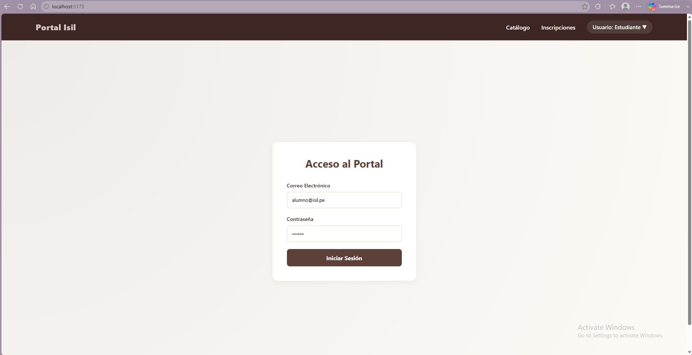
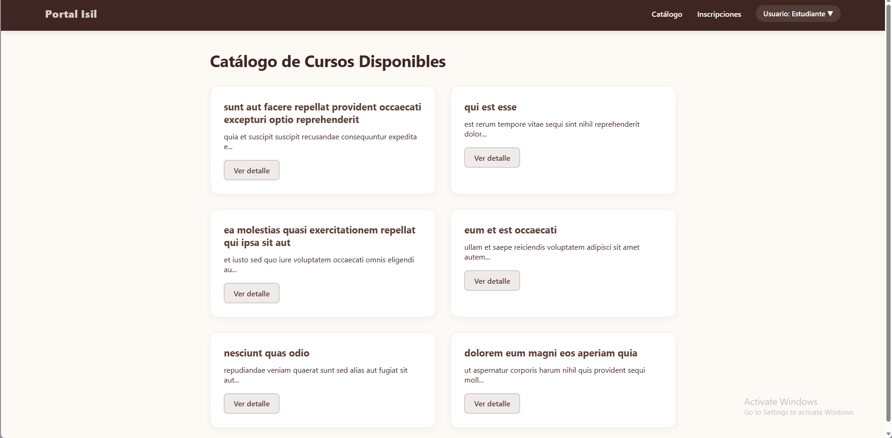
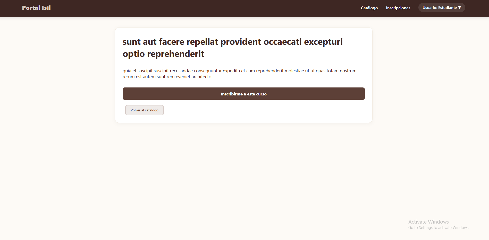
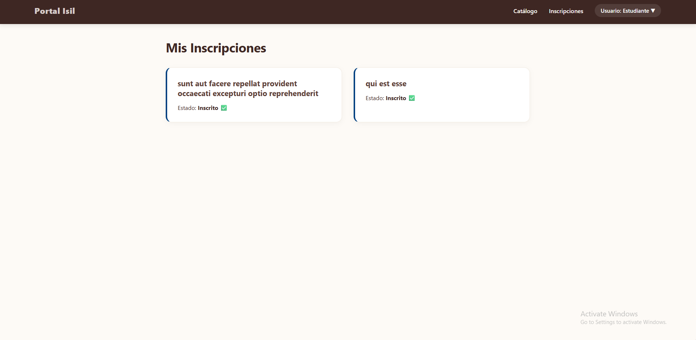
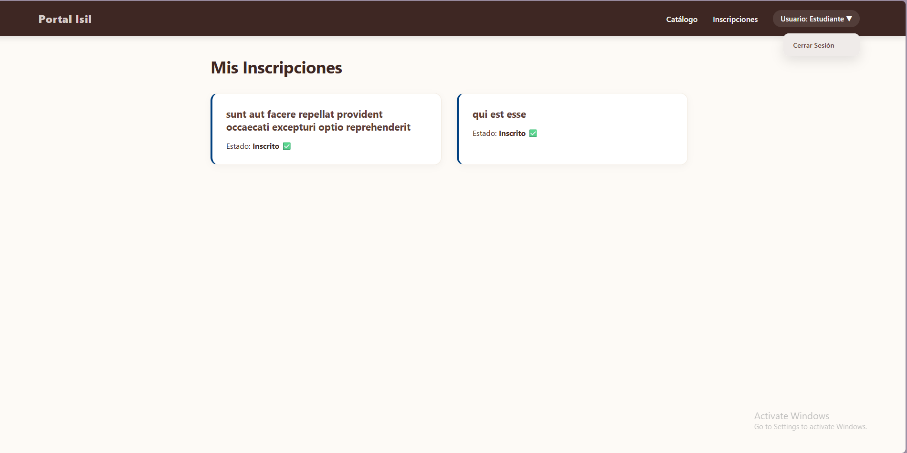

# Gestión de Cursos e Inscripciones - Experiencia Integrada (PA4)

Este proyecto es la solución frontend integrada para la evaluación PA4 del curso de Programación Web II (ISIL). Consiste en un sistema de gestión académica compuesto por dos partes principales: un Portal del Estudiante (Privado) desarrollado en React y un Módulo de Catálogo (Público) construido con Next.js.

##  Integrantes del Equipo

* **Geraldine Khatrina Tudela Theo**
* **Guillermo Fabian Aliaga Matencio**

---

##  Descripción del Proyecto

La aplicación resuelve el caso de negocio planteado por la institución, dividiéndose en dos aplicaciones conectadas de forma conceptual:

1. **Portal del Estudiante (React + Vite):** Un entorno seguro que requiere autenticación (simulación de JWT). Permite al alumno ver el catálogo consumido desde una API REST, ver los detalles de los cursos y gestionar su inscripción (almacenada localmente).
2. **Módulo Público (Next.js):** Una landing page y un catálogo de acceso público que utiliza SSR/rutas dinámicas para exponer la oferta académica a visitantes no autenticados, optimizado para SEO y rendimiento.

---

##  Variables de Entorno

Antes de ejecutar el proyecto, es necesario configurar las variables de entorno. 

En la carpeta raíz de la aplicación React (`portal-react`), crea un archivo llamado `.env` y añade la siguiente línea:
```env
VITE_API_URL=[https://jsonplaceholder.typicode.com](https://jsonplaceholder.typicode.com)
```

---

#  Instalación y Ejecución Paso a Paso

El repositorio funciona como un Monorepo. Para probar el proyecto en un entorno local, cada módulo debe ejecutarse en una terminal independiente.

## Paso 1: Levantar el Portal de React (Privado)

1. Abre una terminal y navega a la carpeta de React:

```bash
cd portal-react
```

2. Instala las dependencias necesarias:

```bash
npm install
```

3. Ejecuta el servidor en modo desarrollo:

```bash
npm run dev
```

### Credenciales de prueba para el Login

- **Correo:** `alumno@isil.pe`
- **Clave:** `123456`

---

## Paso 2: Levantar el Módulo Next.js (Público)

1. Abre una nueva terminal y navega a la carpeta de Next.js:

```bash
cd mi-proyecto-next
```

2. Instala las dependencias necesarias:

```bash
npm install
```

3. Ejecuta el servidor en modo desarrollo:

```bash
npm run dev
```

---

#  Pruebas de Producción (Build)

Para cumplir con la rúbrica del PA4, se debe verificar la preparación técnica del entorno de producción sin errores críticos.

## En la carpeta `portal-react`

```bash
npm run build
npm run preview
```

## En la carpeta `mi-proyecto-next`

```bash
npm run build
npm start
```

---

#  Matriz de Distribución de Aportes

| Integrante | Tareas Asignadas y Completadas |
|------------|--------------------------------|
| **Geraldine Khatrina Tudela Theo** | Estructuración del proyecto, diseño CSS global, ruteo público de Next.js, vistas dinámicas `[id]` y lógica de inscripciones en el catálogo mediante `LocalStorage`. |
| **Guillermo Fabian Aliaga Matencio** | Implementación del `AuthContext`, lógica del Login con JWT, protección de rutas en React (`ProtectedRoute`) y consumo de la API con Axios (`cursosApi.js`). |

---

# Vistas Principales
**Vista Login**



**Vista Catálogo**



**Vista Detalle Curso**



**Vista Inscripciones**



**Vista cerrar Sesión**



#  Sustentación en Video

**Enlace a YouTube:**  
[Click Aquí!! :)](https://youtube.com/)


